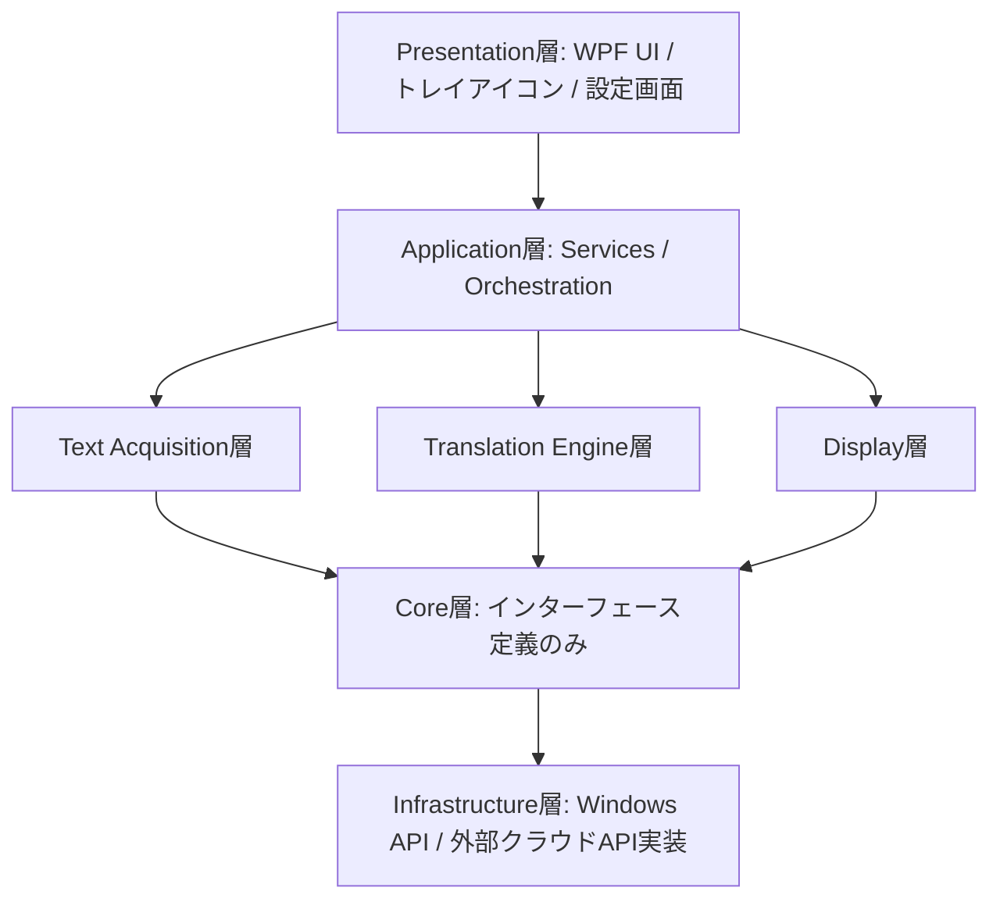
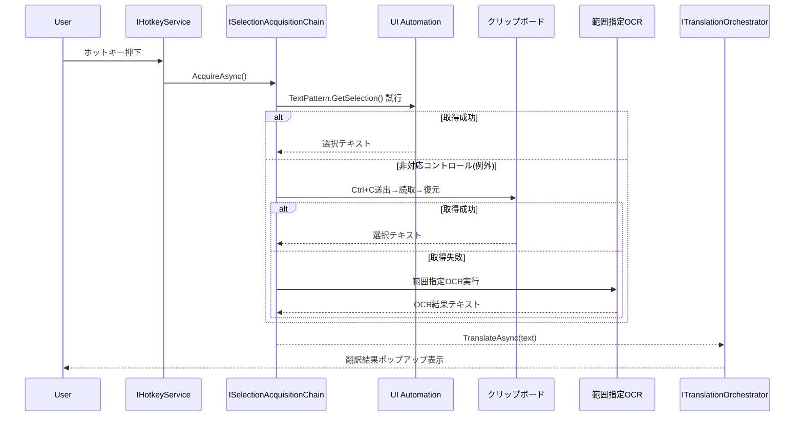

# YakuMado アーキテクチャ設計

## 0. 位置づけ

`docs/prd.md` の要件を実現するためのアーキテクチャ設計。`docs/tech-research-screen-translation.md` の推奨アーキテクチャ(C#/.NET・WPF・ITranslator抽象化)を土台とする。

## 1. 実装言語・フレームワーク

- 言語: C# / .NET 8
- UI: WPF(トレイ常駐アプリ + オーバーレイウィンドウ + 設定ウィンドウ)
- 選定理由は `docs/tech-research-screen-translation.md` セクション6を参照(Win32 API・UI Automation・Windows.Media.Ocr等のWindows APIとの親和性、既存OSS(Translumo/MORT)がいずれもC#/.NETを採用している実績)

## 2. レイヤー構成



- **Core層**: 外部依存を一切持たないインターフェース定義のみ。テスト容易性の核。
- **Text Acquisition層 / Translation Engine層 / Display層**: Application層から見て並列に存在する機能領域。Core層のインターフェースを実装する。
- **Infrastructure層**: 実際のWindows API呼び出し(UI Automation、クリップボード、Windows.Media.Ocr、Windows.Graphics.Capture等)やクラウドAPI(Google/Azure/DeepL)呼び出しの実装。

## 3. プロジェクト構成

```
YakuMado.sln
├── src/
│   ├── YakuMado.Core/                    (net8.0, 外部依存なし)
│   ├── YakuMado.TextAcquisition/         (net8.0-windows10.0.19041.0)
│   ├── YakuMado.Ocr/                     (net8.0-windows10.0.19041.0)
│   ├── YakuMado.Translation.Cloud/       (net8.0)
│   ├── YakuMado.Translation.Local/       (net8.0)
│   ├── YakuMado.Translation.Orchestration/ (net8.0)
│   ├── YakuMado.Overlay/                 (net8.0-windows10.0.19041.0, WPF)
│   ├── YakuMado.Settings/                (net8.0-windows10.0.19041.0, DPAPI利用)
│   └── YakuMado.App/                     (net8.0-windows10.0.19041.0, エントリポイント)
└── tests/
    ├── YakuMado.Core.Tests/
    ├── YakuMado.Translation.Orchestration.Tests/
    ├── YakuMado.TextAcquisition.Tests/
    └── ...(層ごとに対応するテストプロジェクト)
```

**TFM(Target Framework)戦略**: 純粋ロジック層(`Core`, `Translation.Orchestration`, `Translation.Cloud`, `Translation.Local`)は `net8.0` とし、CIやクロスプラットフォーム環境でもユニットテストを実行可能にする。Windows専用API(UI Automation, クリップボード, Windows.Media.Ocr, Windows.Graphics.Capture, WPF)に依存する層は `net8.0-windows10.0.19041.0` とする。

## 4. 主要インターフェース設計

### 4.1 翻訳エンジン抽象化(Core)

```csharp
namespace YakuMado.Core;

public interface ITranslator
{
    string EngineName { get; }
    bool IsAvailable { get; }
    IReadOnlyCollection<LanguagePair> SupportedLanguagePairs { get; }

    Task<TranslationResult> TranslateAsync(
        string sourceText,
        LanguagePair languagePair,
        CancellationToken cancellationToken);
}

public readonly record struct LanguagePair(string SourceCode, string TargetCode);

public record TranslationResult(string TranslatedText, string EngineName, TimeSpan Elapsed);
```

- `IsAvailable`: モデル未配置・APIキー未設定・ネットワーク不可などの理由で `false` を自己申告する。呼び出し側はこれを見て次候補へフォールバックする。
- 英→日ローカルNMTモデルの実用性が未確認(`docs/prd.md` セクション6)なため、`Translation.Local` 実装は `IsAvailable=false` を返すだけでクラウドのみ構成にシームレスに縮退できる設計とする。ロジック変更は不要。

### 4.2 翻訳オーケストレーション(Translation.Orchestration)

```csharp
namespace YakuMado.Translation.Orchestration;

public interface ITranslationOrchestrator
{
    Task<TranslationResult> TranslateAsync(
        string sourceText,
        LanguagePair languagePair,
        CancellationToken cancellationToken);
}
```

処理フロー:
1. `ITranslationCache` を確認し、ヒットすれば即返却
2. `TranslationSettings` の優先順位順に `ITranslator` を走査し、`IsAvailable` と `SupportedLanguagePairs` でフィルタ
3. サーキットブレーカー(後述)で除外されていないエンジンにタイムアウト付きでリクエスト
4. 失敗時は次候補へ、成功時はキャッシュに書き込んで返却

```csharp
public interface ICircuitBreaker
{
    bool IsOpen(string engineName);
    void RecordFailure(string engineName);
    void RecordSuccess(string engineName);
}
```

サーキットブレーカーは、翻訳エンジンが連続失敗した場合に一定時間候補から除外し、無駄なタイムアウト待ちを回避する。

### 4.3 選択テキスト取得(Core / TextAcquisition)

```csharp
namespace YakuMado.Core;

public interface ITextSelectionProvider
{
    string ProviderName { get; }
    Task<string?> TryGetSelectedTextAsync(CancellationToken cancellationToken);
}

public interface ISelectionAcquisitionChain
{
    Task<string?> AcquireAsync(CancellationToken cancellationToken);
}
```

`ISelectionAcquisitionChain` の実装が、F3で定義した3段階フォールバック(UI Automation → クリップボード → 範囲指定OCR)を順に試行する。

```csharp
namespace YakuMado.TextAcquisition;

public sealed class ClipboardSelectionProvider : ITextSelectionProvider
{
    // AddClipboardFormatListener + WM_CLIPBOARDUPDATE(公式推奨方式、旧ビューアチェーン方式は非推奨)で監視
    // Ctrl+C送出 → クリップボード読取 → 元の内容へ復元、の順で処理する
}
```

### 4.4 OCR(Ocr)

```csharp
namespace YakuMado.Core;

public interface IOcrEngine
{
    Task<OcrResult> RecognizeAsync(IScreenBitmap bitmap, CancellationToken cancellationToken);
}
```

`WindowsOcrEngine` が `Windows.Media.Ocr.OcrEngine`(Windows 10.0.10240.0、UniversalApiContract v1.0以降で利用可能と一次ソース確認済み)をラップする一次実装とする。

### 4.5 画面キャプチャ・変化検知(Ocr / Display)

```csharp
namespace YakuMado.Core;

public interface IScreenCaptureService
{
    Task<IScreenBitmap> CaptureAsync(CaptureRegion region, CancellationToken cancellationToken);
}

public interface IFrameChangeDetector
{
    bool HasChanged(IScreenBitmap previous, IScreenBitmap current);
}
```

`Windows.Graphics.Capture` を採用する(BitBltは一部アプリで黒画面問題が確認されているため不採用)。`IFrameChangeDetector` は再翻訳の要否判定に用い、非同期翻訳完了までの再出現(F2の「再出現時50ms以内」)をキャッシュと組み合わせて実現する。

### 4.6 オーバーレイ表示(Overlay)

```csharp
namespace YakuMado.Core;

public interface IOverlayWindowController
{
    void ShowOverlay(IReadOnlyCollection<OverlayTextBlock> textBlocks);
    void ClearOverlay();
}

public interface ISelectionPopupController
{
    void ShowPopup(string translatedText, ScreenPoint anchor);
}
```

クリックスルーを実現するため、拡張ウィンドウスタイル `WS_EX_LAYERED | WS_EX_TRANSPARENT | WS_EX_TOPMOST | WS_EX_NOACTIVATE` を使用する(またはWPFの `WindowStyle=None` + `AllowsTransparency=True` の組み合わせ)。座標変換・DPI対応(`IScreenCaptureService` のキャプチャ座標 → 画面物理座標 → WPF論理座標)を `IOverlayWindowController` 実装内で吸収する。

### 4.7 キャッシュ(Translation.Orchestration)

```csharp
namespace YakuMado.Core;

public interface ITranslationCache
{
    bool TryGet(string normalizedKey, LanguagePair languagePair, out TranslationResult? result);
    void Set(string normalizedKey, LanguagePair languagePair, TranslationResult result);
}
```

`LruTranslationCache` を `MemoryCache` ベースで実装し、正規化キー(前後空白除去・改行統一等)で同一テキストの再翻訳を回避する。

### 4.8 設定(Settings)

```csharp
namespace YakuMado.Core;

public record TranslationSettings(
    IReadOnlyList<string> EnginePriorityOrder,
    IReadOnlyDictionary<string, bool> EngineEnabled,
    IReadOnlyDictionary<string, string> ApiKeys); // 保存時はDPAPIで暗号化
```

### 4.9 ホットキー(TextAcquisition / App)

```csharp
namespace YakuMado.Core;

public interface IHotkeyService
{
    event EventHandler? SelectionTranslateRequested;
    void Register();
    void Unregister();
}
```

## 5. 選択テキスト取得フロー(詳細)



## 6. 実装フェーズ分割

| Phase | 内容 | 備考 |
|-------|------|------|
| Phase 0 | PoC①選択テキスト取得の実機検証、②英→日ローカルNMTモデルの実用性検証、③オーバーレイ描画のクリックスルー実機検証 | ②は最優先。結果がPhase 4のスコープをブロックする |
| Phase 1 | 基盤構築(Core層インターフェース確定、DIコンテナ、設定基盤) | |
| Phase 2 | 選択テキスト翻訳MVP(F1, F3, F4の一部) | |
| Phase 3 | 画面オーバーレイ翻訳MVP(F2) | |
| Phase 4 | ローカルNMT統合 | PoC②の結果次第でスコープ調整(クラウドのみ構成への縮退を含む) |
| Phase 5 | ハイブリッド切替の仕上げ(サーキットブレーカー等) | |
| Phase 6 | 品質・パフォーマンスチューニング・配布パッケージング | |

## 7. テスト方針(層別)

| 層 | 方針 |
|----|------|
| Core | TDD全面適用 |
| Translation.Orchestration | TDD全面適用。フェイク `ITranslator` 実装で切替ロジック・サーキットブレーカーを検証 |
| Translation.Cloud | 契約テスト中心(実APIコールは最小限に留める) |
| Translation.Local | `IsAvailable` 判定ロジックのみテスト対象 |
| TextAcquisition | クリップボードの退避・復元は必ずTDD対象とする(復元漏れはユーザー環境を壊すため) |
| Ocr | 周辺ロジック(座標変換等)のみTDD対象。実OCR呼び出し自体は自動テスト対象外 |
| Overlay | MVVM徹底。ViewModelをTDD対象、実描画は手動確認 |
| E2E | 手動テスト手順書を作成し、Phase毎に実機で選択テキスト翻訳・オーバーレイ翻訳の動作を確認 |

## 8. 検証方法

- 各Phase完了時、該当層のユニットテストを `dotnet test` で実行し全てgreenであることを確認する
- Phase 0のPoCは実機(Windows)での動作確認が必須(自動テスト不可)
- Phase 2・3完了時点でブラウザ・メモ帳等の実アプリに対し、選択テキスト翻訳・オーバーレイ翻訳が実際に動作することを目視確認する

## 9. 参照ドキュメント

- 要件定義: `docs/prd.md`
- 技術調査レポート: `docs/tech-research-screen-translation.md`
