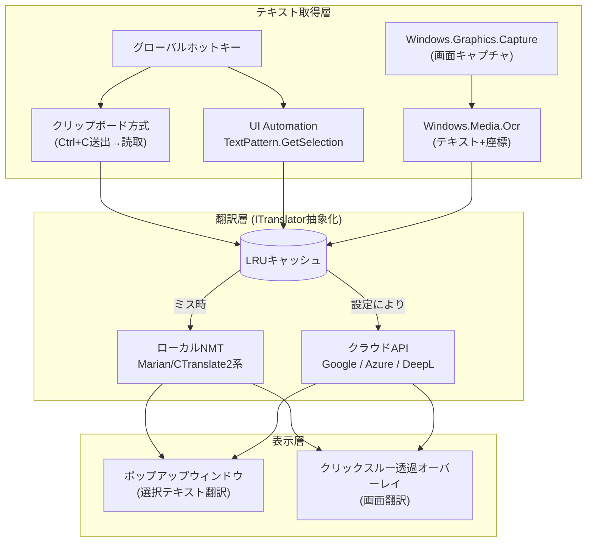
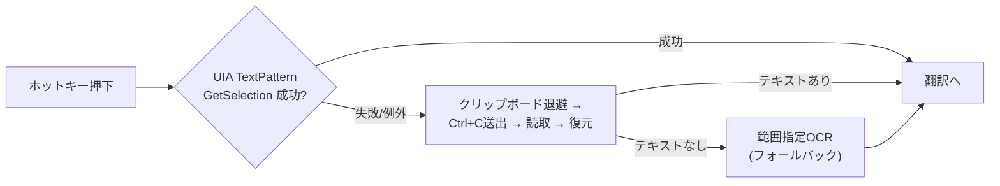

# YakuMado 技術調査レポート — Windows画面翻訳ソフトの実現方法

作成日: 2026-07-16
調査方法: deep-research ワークフロー(5系統の並列Web検索 → 22ソース取得 → 106主張抽出 → 検証 → 統合)

## 0. 要件の整理

| # | 要件 | 優先度 |
|---|------|--------|
| 1 | Webブラウザや各種アプリの画面上の英語テキストを日本語に翻訳して表示 | 必須 |
| 2 | ユーザーが選択したテキストの日本語翻訳 | **絶対必須** |
| 3 | 翻訳速度の高速性 | **最重要目的** |
| 4 | 実装形態はWindowsデスクトップアプリ | 前提 |

## 1. 結論(推奨アーキテクチャの要約)

- **選択テキスト翻訳(必須機能)**: グローバルホットキー → `Ctrl+C` 送出 → クリップボード読み取り → 翻訳 → カーソル近傍にポップアップ表示。この「クリップボード方式」が最も汎用的で、商用RPA(UiPath)も同方式を採用している。UI Automation の `TextPattern.GetSelection` は対応アプリでは高速・確実だが非対応アプリが多く、フォールバック付きの補助手段とする。
- **画面翻訳(オーバーレイ)**: `Windows.Graphics.Capture` で画面キャプチャ → **Windows.Media.Ocr(OS標準OCR)** でテキスト+座標を取得 → 翻訳 → クリックスルー透過ウィンドウで原文位置に訳文をオーバーレイ表示。既存OSS(Translumo)で実証済みのパイプライン。
- **翻訳エンジン**: `ITranslator` インターフェースで抽象化し、**ローカルNMT(Marian/Bergamot系 or CTranslate2 + 小型モデル)を第一候補**、クラウドAPI(速度なら Google/Azure、品質なら DeepL)を切り替え/併用可能にする。翻訳結果はLRUキャッシュして再翻訳を回避する。
- **実装言語**: **C#/.NET(WPF)** を推奨。Windows OCR・UI Automation・クリップボードAPI・透過オーバーレイのすべてに公式APIでアクセスでき、同種OSS(Translumo=.NET 8+WPF、MORT=.NET 9)での実績が最も厚い。

図1: 推奨アーキテクチャ全体像

---

## 2. 画面上テキストの取得方法

### 2.1 方式の比較

UiPath(商用RPAベンダー)の画面スクレイピング方式比較が定量的な指標を公開している(出典: [UiPath Docs](https://docs.uipath.com/activities/other/latest/ui-automation/output-or-screen-scraping-methods)、検証済み 3-0):

| 方式 | 速度 | 精度 | 座標取得 | 制約 |
|------|------|------|----------|------|
| FullText (アクセシビリティ/API系) | 10/10 | 100% | 不可 | 対応アプリのみ |
| Native (GDIフック) | 8/10 | 100% | **可** | GDI描画アプリのみ(モダンブラウザはDirectWrite描画のため対象外) |
| OCR | 3/10 | 98% | **可** | なし(全アプリで動作) |

**事実(検証済み)**: API/アクセシビリティ系のテキスト取得はOCRより圧倒的に高速・正確。ただし座標が取れない方式もあり、オーバーレイ表示には座標が必須。
**含意**: 速度最優先でも「APIだけ」「OCRだけ」では要件を満たせず、**用途ごとに方式を使い分けるハイブリッド構成**が必要。

### 2.2 OCR エンジンの選択

- **Windows.Media.Ocr (OS標準)**: Windows 10 初期ビルドから搭載され外部依存なしで利用可能。**追加検証済み(2026-07-16)**: 公式リファレンスで「Device family: Windows 10 (introduced in 10.0.10240.0)」「API contract: Windows.Foundation.UniversalApiContract (introduced in v1.0)」と明記されており、Windows 10の最初期ビルドから利用可能という記述は正確と確認。`RecognizeAsync` に `SoftwareBitmap` を渡すと、行(OcrLine)→単語(OcrWord)の階層で**テキスト+位置+サイズ**が返り、オーバーレイ表示に必要な座標が直接得られる(出典: [Microsoft Learn](https://learn.microsoft.com/en-us/uwp/api/windows.media.ocr.ocrengine))。
- 既存OSS Translumo は Windows OCR / Tesseract 5.2 / EasyOCR の3エンジンをサポートするが、**「Windows OCRのみの使用を推奨」**とし、Tesseract は「古く、遅く、エラーが多い」、EasyOCR は「さらに遅い」と明記している(出典: [Translumo README](https://github.com/ramjke/Translumo))。
- Tesseract 5.5 は CPU のみで請求書画像を約0.77秒処理、PaddleOCR は同条件4.85秒という比較ブログがある(出典: codesota.com、ブログ品質のため参考値)。
- **Windows App SDK の新 Text Recognition API** は Windows.Media.Ocr より高速・高精度とMicrosoftは主張するが、**NPU搭載機(Copilot+ PC)専用**であり、一般PCでは使えない。**追加検証済み(2026-07-16、一次ソース再確認)**: 「They run exclusively on devices with a neural processing unit (NPU), making them faster and more accurate than the legacy Windows.Media.Ocr.OcrEngine APIs」と明記されており、NPU専用という制約は事実として確定。バウンディングボックス・信頼度スコア(`word.BoundingBox`, `word.Confidence`)も提供されることを確認(出典: [Microsoft Learn](https://learn.microsoft.com/en-us/windows/ai/apis/text-recognition))。一般的なNPU非搭載PC向けには使えないため、将来のオプション扱いが妥当という結論は維持。

**推奨**: 第一候補は **Windows.Media.Ocr**(追加配布物ゼロ・座標付き・既存OSSでの実績)。エンジンは差し替え可能に抽象化しておく(Translumo/MORT/LunaTranslator の3OSSすべてがOCR抽象化レイヤーを持つ)。

### 2.3 選択テキストの取得(必須要件)

3つの手段があり、カバレッジと速度のトレードオフがある。

1. **クリップボード方式(推奨・主軸)**
   - グローバルホットキー押下 → 対象アプリに `Ctrl+C` を送出 → クリップボードを読み取る。
   - UiPath の「Copy Selected Text」アクティビティもUIAではなく**クリップボード機能で選択テキストを取得**しており、汎用手段としての実績がある(出典: UiPath Docs)。
   - クリップボード監視が必要な場合(コピー操作をトリガーに自動翻訳)は、`AddClipboardFormatListener` + `WM_CLIPBOARDUPDATE` が公式推奨方式(旧ビューアチェーン方式は非推奨)(出典: [Microsoft Learn — Using the Clipboard](https://learn.microsoft.com/en-us/windows/win32/dataxchg/using-the-clipboard))。
   - 注意点(推測含む): ユーザーのクリップボード内容を上書きするため、退避・復元の実装が必要。
2. **UI Automation `TextPattern.GetSelection`(補助)**
   - 対応コントロールでは選択中テキストをAPIで直接取得でき、クリップボードを汚さない。選択変更は `TextSelectionChangedEvent` で通知される(出典: [Microsoft Learn — TextPattern Overview](https://learn.microsoft.com/en-us/dotnet/framework/ui-automation/ui-automation-textpattern-overview))。
   - ただし非対応コントロールでは `InvalidOperationException` になるためフォールバック必須。また TextPattern は**プロセス間呼び出し依存でキャッシュ機構がなく**、高頻度アクセスではレイテンシが課題(同上)。
3. **OCR(最終フォールバック)**
   - 画像化された画面(リモートデスクトップ等)でも動く唯一の手段。マウスドラッグ範囲をOCRする方式。

図2: 選択テキスト取得のフォールバック戦略

---

## 3. 翻訳エンジンの比較

### 3.1 クラウドAPI

複数のベンチマーク系ブログの数値(いずれも二次情報のため幅を持って解釈):

| API | レイテンシ(短文) | 料金(100万文字) | 無料枠 | 備考 |
|-----|------------------|------------------|--------|------|
| Google Translate (NMT) | 約50ms〜0.6秒 | $20 | 月50万文字 | 最速級との評価が複数 |
| Azure Translator | 約75ms〜0.7秒(中央値0.09秒/セグメントの計測例) | **$10(最安)** | **月200万文字(最大)** | 速度・コストのバランス良 |
| DeepL API | 約150ms〜1秒 | $25 + 月額$5.49 | 月50万文字 | 品質評価は最上位(編集量がGPT-4/Googleの1/2〜1/3という主張あり) |
| LLM系 (GPT-4o / Claude) | 約800ms〜1秒+ | 従量(高) | — | **リアルタイム用途には遅い**との評価で一致 |

出典: chatscontrol.com / translateplus.io / intlpull.com(いずれもブログ品質。数値は測定条件依存で相互に幅があるため、**採用前に自前ベンチマーク必須**)

**追加検証済み(2026-07-16)**: 上記3ブログの数値が相互に食い違っていた点(DeepLを最速とする記述と最遅とする記述が混在)について、追加のWeb調査を実施。その結果、**測定リージョンとの近接性で数十〜数百msの差が出るため、ブログごとに順位が入れ替わって見えているだけ**という説明が複数の開発者向け情報源で一致した。具体的には「Azure/US東海岸から約150ms、地理的に遠いと約280ms」「DeepL APIの単文呼び出しは200ms未満」という報告があり、「実測ではテスト地域からのリクエストの多くが互いに50ms以内の差であり、システム設計を左右するほどの優劣はない」という指摘もある。ただし公式(Google/Microsoft/DeepL自身)のレイテンシ仕様は今回も発見できず、依然としてベンチマークはサードパーティのブログ情報に留まる。

**確度の高い傾向**(複数ソース一致): ①従来型NMT系API(Google/Azure/DeepL)は**互いの速度差は小さく(概ね数十〜200ms台)、リージョン近接性が支配的要因**であり、どれか一つが恒常的に別を大きく上回るわけではない ②これらNMT系APIはLLM系(GPT-4o/Claude等)より**一桁〜二桁(10〜20倍)高速** ③DeepLは品質面の評価が高い ④コストはAzureが最安・無料枠最大。**結論**: クラウドAPI間の速度差を理由に特定ベンダーを選ぶ根拠は薄く、「NMT系 vs LLM系」の方が意思決定上のインパクトが大きい。

### 3.2 ローカル(オフライン)翻訳エンジン

| エンジン/モデル | サイズ | 速度 | 品質 | ライセンス |
|------------------|--------|------|------|-----------|
| Bergamot / Firefox Translations (Marian NMT) | **約17MB/言語ペア**(量子化student、**en-pt実測値**) | 教師比37倍(1CPUコアで実用速度、**en-pt実測値**) | BLEU低下は教師比約1.8pt(52.5→50.7、**en-pt実測値**)。一部言語ペアでクラウド同等というMozilla自己評価 | MPL系(要確認) |
| OPUS-MT (+ CTranslate2) | 小型 | 高速(int8量子化で更に向上) | ドラフト品質のベースライン向き | **Apache-2.0** |
| FuguMT (日英特化) | 約300MB | 高速 | Sugoi-v4同等との評価(フォーラム情報) | 要確認 |
| ~~Sugoi-v4~~ | 約300MB(全体約1GB) | CTranslate2でint8量子化可 | 日英ゲーム翻訳で定評だが**方向は日→英(ja→en)専用と確認。英→日の要件には適用不可** | 要確認 |
| NLLB-200 | 大 | 中 | 広カバレッジ | **CC-BY-NC-4.0(非商用)— 商用配布に制約**(**追加検証済み**: モデルカードに「NLLB-200 is a research model and is not released for production deployment」と明記。商用の画面翻訳ソフトへの組み込みは不可) |
| ローカルLLM (Qwen 32B級) | 数十GB | 遅 | 英→日はクラウド品質の80〜90%程度との評価 | — |

出典: [Mozilla Hacks](https://hacks.mozilla.org/2022/06/training-efficient-neural-network-models-for-firefox-translations/) / HuggingFaceフォーラム / insiderllm.com / AMD ROCmブログ / Hugging Face(Sugoi-v4-ja-en-ct2)

**追加検証済み(2026-07-16)**:
- **Bergamotの「47倍小型・37倍高速」は英語→ポルトガル語(en-pt)限定の実測値であり、記事内に英→日本語(en-ja)への言及は一切ない**。手法(教師-生徒蒸留+量子化)自体は言語非依存の技術だが、英→日での同等の速度・品質が出るかは未実証。Bergamotの公式モデルリストに英日ペアが含まれるか、含まれる場合の実測値を別途確認する必要がある。
- **Sugoi-v4は日→英(ja→en)専用モデルであることを確認**(Hugging Face配布名が軒並み `sugoi-v4-ja-en-*`)。本プロジェクトの要件(英→日)には**そのままでは使えない**。表からは翻訳方向不一致として除外扱いとする。

**確度の高い傾向**: ①翻訳専用NMTは汎用LLMより小型・高速で、翻訳タスク限定なら品質も遜色ない(複数ソース一致) ②Marian系(Bergamot)の蒸留+量子化手法はCPUのみでリアルタイム翻訳可能なことがen-ptで実証済み(Firefoxに実搭載)だが、**英→日での同等性能は未実証** ③**英→日はローカルモデルにとって難しい言語ペア**であり、品質は実測評価が必須(推測を含む) ④日→英特化のSugoi-v4/FuguMTは本プロジェクトの翻訳方向とは逆であり第一候補にはならない。

### 3.3 ローカル vs クラウドの使い分け(推奨)

- **速度最重要**という要件から、**ネットワーク往復(数十〜数百ms)自体を排除できるローカルNMTを第一候補**とする。ただし追加検証の結果、**英→日方向で実測データがある軽量ローカルモデルは今回のソースからは見つからなかった**(Bergamotはen-pt限定、Sugoi/FuguMTは日→英)。OPUS-MTやNLLB系の英日モデルの有無・品質は別途PoCでの確認が必須。
- クラウドAPI間では、追加検証の結果**速度差はリージョン依存で小さく、ベンダー選定を速度だけで決める根拠は薄い**ことが判明した。コスト(Azureが最安)や品質(DeepLが高評価)を主軸に選定するのが妥当。
- クラウドは「高品質モード」または「ローカルモデル未整備時の代替」として併存させる。エンジンは既存OSS 3種すべてが採用する**プラガブル構成**(切り替え可能な抽象化レイヤー)にする。
- **キャッシュが最大の高速化要素**(推測だが定石): 画面翻訳では同じ文が繰り返し出現するため、原文→訳文のLRUキャッシュで実効レイテンシをほぼゼロにできる。これはローカル/クラウドどちらを採用しても効果があり、方向性の不確実性に左右されない確実な高速化策。

---

## 4. オーバーレイ表示の実装方式

- Translumo(C#/.NET 8 + WPF)が「キャプチャ → OCR → 翻訳 → オーバーレイウィンドウ表示」のパイプラインを実運用しており、低レイテンシ最適化を設計目標に掲げている(出典: Translumo README / DeepWiki)。
- 実装の定石(知識ベース、要実装検証):
  - WPFの透過ウィンドウ(`WindowStyle=None` + `AllowsTransparency=True`)、または Win32 拡張スタイル `WS_EX_LAYERED | WS_EX_TRANSPARENT | WS_EX_TOPMOST` で**クリックスルー**(マウスイベントを下のウィンドウへ透過)を実現する。
  - `WS_EX_NOACTIVATE` でフォーカスを奪わないようにする。
  - OCRが返す単語/行の座標(DPIスケーリング補正が必要)に合わせて訳文を配置する。
  - 画面キャプチャは `Windows.Graphics.Capture`(Windows 10 1803+)が現行推奨。従来の `BitBlt` はハードウェアアクセラレーション描画のウィンドウで黒画面になるケースがある(知識ベース)。

---

## 5. 既存OSS画面翻訳ソフトのアーキテクチャ

| ソフト | 言語/FW | テキスト取得 | 翻訳エンジン | 特徴 |
|--------|---------|--------------|--------------|------|
| [Translumo](https://github.com/ramjke/Translumo) | C# / .NET 8 / WPF | OCR 3種併用(Windows OCR推奨) + MLで最良結果を選択 | クラウドのみ(DeepL推奨/Google/Yandex/Papago) | 低レイテンシを設計目標に明記。オーバーレイ表示。**(追加検証済み: READMEの記述と完全一致を確認)** |
| [MORT](https://github.com/killkimno/mort) | C# / .NET 9 | OCR 5種切替(Tesseract/Windows OCR/Google Vision/Snipping Tool OCR/EasyOCR) | Papago/Google/DeepL/ezTrans(ローカル) + カスタムHTTP APIでLibreTranslate・NLLB等も接続可 | OCRと翻訳の完全分離・プラガブル構成。**(追加検証済み: READMEの記述と完全一致を確認。要件はWindows 10以上・.NET 9以上・C# 100%)** |
| [LunaTranslator](https://github.com/HIllya51/LunaTranslator) | Python主体 | **プロセスフック主軸** + OCR補助 | ほぼ全対応(LLM/オフライン/クラウド)の抽象化レイヤー | ゲーム特化。フックはOCR不要で高速・高精度だが対象を選ぶ |
| PCOT | (C#/.NET, 知識ベース) | 範囲指定OCR | クラウド系 | 今回の調査ではソースを直接取得できず(未検証) |

**設計上の共通パターン(3OSSで一致)**: ①OCRエンジンの抽象化・複数対応 ②翻訳エンジンの抽象化・プラガブル構成 ③C#/.NETがWindows向け実装の主流(LunaTranslatorを除く)。

---

## 6. 実装言語/フレームワークの選択

| 選択肢 | 評価 |
|--------|------|
| **C#/.NET (WPF)** — 推奨 | Windows OCR(WinRT)・UI Automation・クリップボードAPI・透過ウィンドウすべてに公式サポート。Translumo(.NET 8+WPF)/MORT(.NET 9)の実績。CTranslate2やBergamotはネイティブDLL経由で呼び出し可能 |
| WinUI 3 | モダンだが透過・クリックスルーオーバーレイの制約が WPF より多い(知識ベース、要検証)。オーバーレイ用途では WPF が無難 |
| Rust | ネイティブ性能とメモリ安全だが、WinRT/UIA バインディング(windows-rsクレート)の実装コストが高く、同種ソフトの実績が薄い |
| Python | LunaTranslatorの実績はあるが、配布サイズ・起動速度・オーバーレイ実装の面でC#に劣る。ML実験には有用 |

---

## 7. 高速化の設計ポイント(要件3への直接回答)

1. **テキスト取得の高速化**: 選択テキストはクリップボード方式(数十ms級)。画面翻訳はOCR対象領域を差分検出で絞り、変化のないフレームは再OCRしない(Translumoが同様の最適化を主張)。
2. **翻訳の高速化**:
   - ローカルNMT(Marian蒸留モデル: 1CPUコアで実用速度、17MB/ペア)でネットワーク往復を排除。
   - LRUキャッシュで既訳文を即時返却。
   - クラウド利用時は文単位のバッチ化 + HTTP/2接続の使い回し(コネクション確立コストの排除)。
   - LLM系APIは現時点ではリアルタイム用途に不向き(800ms+)。
3. **表示の高速化**: オーバーレイは常駐させ、表示内容の更新のみ行う(ウィンドウ生成コストの排除)。

---

## 8. 事実と推測の区別・検証状況

- **検証済み(3票一致・deep-researchワークフロー内)**: UiPathのスクレイピング方式比較(FullText 10/10・100%、Native 8/10・座標可・GDI限定)。
- **追加検証済み(2026-07-16、人手によるWebFetch/WebSearch再確認)**:
  - Windows App SDK Text Recognition APIのNPU専用制約 → **一次ソースで確認・確定**。
  - Bergamotの「47倍小型・37倍高速」 → **en-pt限定の実測値と判明。英→日への一般化は未実証**(レポートの記述を修正済み)。
  - クラウドAPI(Google/Azure/DeepL)のレイテンシ比較 → **ブログ間の数値の食い違いはリージョン依存の測定条件差と判明。ベンダー間の恒常的な速度差は小さいと結論**(レポートの記述を修正済み)。
  - Sugoi-v4の翻訳方向 → **日→英(ja→en)専用と確認。英→日要件には不適合**(レポートで除外扱いに修正済み)。
- **追加検証済み(2026-07-16、優先度B)**:
  - OcrEngineの対応バージョン → **一次ソースで確認・確定**(Windows 10 10.0.10240.0 / UniversalApiContract v1.0から利用可能)。
  - NLLB-200のライセンス → **一次ソースで確認・確定**(CC-BY-NC-4.0、モデルカードに「research model, not released for production deployment」と明記。商用利用不可)。
  - Translumo/MORTのREADME記載内容(OCR・翻訳エンジン構成、実装言語/FW) → **両方とも再取得し、レポートの記述と完全一致を確認**。
- **出典引用あり・未検証(上記以外)**: 本レポートの残りの主張(LunaTranslatorのREADME詳細、UI Automation TextPatternの仕様詳細など)は一次ソースからの引用付き抽出だが、deep-researchワークフローの敵対的検証フェーズがセッションリミットで大半未完了。一次ソース由来のため確度は高いが、実装前に該当ドキュメントの現物確認を推奨。
- **ブログ由来の数値(要注意)**: Tesseract vs PaddleOCR速度比較(codesota.com)は測定条件不明のブログ情報。**採用判断には自前ベンチマークが必須**。
- **知識ベースの推測(未出典)**: クリックスルーオーバーレイの実装詳細(WS_EX_*スタイル)、BitBltの黒画面問題、WinUI 3の透過制約、PCOTの構成。
- **未解決の重要な不確実性**: 英→日方向で実用的な速度・品質を持つ軽量ローカルNMTモデルの具体的な候補(OPUS-MT/NLLB系の英日ペア実測値)は今回の調査で特定できなかった。PoC②で最優先に確認すべき事項。

---

## 9. 次の行動

1. **PoC①(選択テキスト翻訳・最優先)**: C#でグローバルホットキー + クリップボード方式 + 翻訳API 1種(まずAzureかGoogle)のミニマム実装で、押下→表示のエンドツーエンド遅延を実測する。
2. **PoC②(ローカル翻訳の品質・速度検証・最優先で不確実性を解消)**: 追加検証の結果、英→日で実測済みの軽量ローカルモデル候補が特定できなかったため、まず OPUS-MT や Bergamot の英日(en-ja)モデルが実在するかを確認し、存在すれば CTranslate2 経由で品質と速度を実測してクラウドと比較する。存在しない場合はローカルNMT路線の再検討(NLLB-200の非商用ライセンス下での評価利用、または多言語対応の他モデル探索)が必要。
3. **PoC③(画面OCR)**: Windows.Graphics.Capture + Windows.Media.Ocr で英語テキストの認識精度・座標精度・処理時間を実測する。
4. PoC結果を踏まえて要件定義(PRD)とアーキテクチャ設計に進む(development-workflowのPlanフェーズ)。
